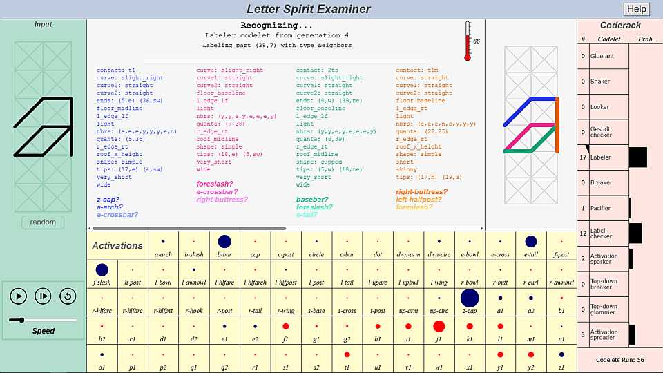

# letter-spirit-examiner-js

 

This is a JavaScript implementation of the [Letter Spirit Examiner](https://en.wikipedia.org/wiki/Fluid_Concepts_and_Creative_Analogies#Chapter_10:_Letter_Spirit),
a computer model of human letter-recognition developed by [Douglas Hofstadter](https://en.wikipedia.org/wiki/Douglas_Hofstadter), [Gary McGraw](https://www.garymcgraw.com/), and [John Rehling](https://scholar.google.com.br/scholar?q=john+rehling). 

[You can try it out here.](https://paul-g2.github.io/letter-spirit-examiner-js/)

The Examiner is described in the book [<i>Fluid Concepts and Creative Analogies</i>](https://en.wikipedia.org/wiki/Fluid_Concepts_and_Creative_Analogies), 
and in the Ph.D. theses of [McGraw](https://www.garymcgraw.com/technology/writings/thesis/) and 
[Rehling](https://github.com/Alex-Linhares/FARGonautica/blob/master/Literature/Ph.D.%20Theses/Rehling-2001-Letter.Spirit.part.Two.pdf).

I got interested in Letter Spirit, and the Hofstadter group's other projects, after reading the <i>Fluid Concepts and Creative Analogies</i> book,
but I couldn't find demos that were easy to get up and running. Hence this repo, and the related [copycat-js](https://github.com/Paul-G2/copycat-js) project.

My implementation is heavily based on [Rehling's original Scheme code](https://github.com/Alex-Linhares/FARGonautica/tree/master/Software/Letter-Spirit). 
The look of the UI is based on screenshots contained in the McGraw thesis, and on [James Marshall's Metacat](http://science.slc.edu/jmarshall/metacat/).
